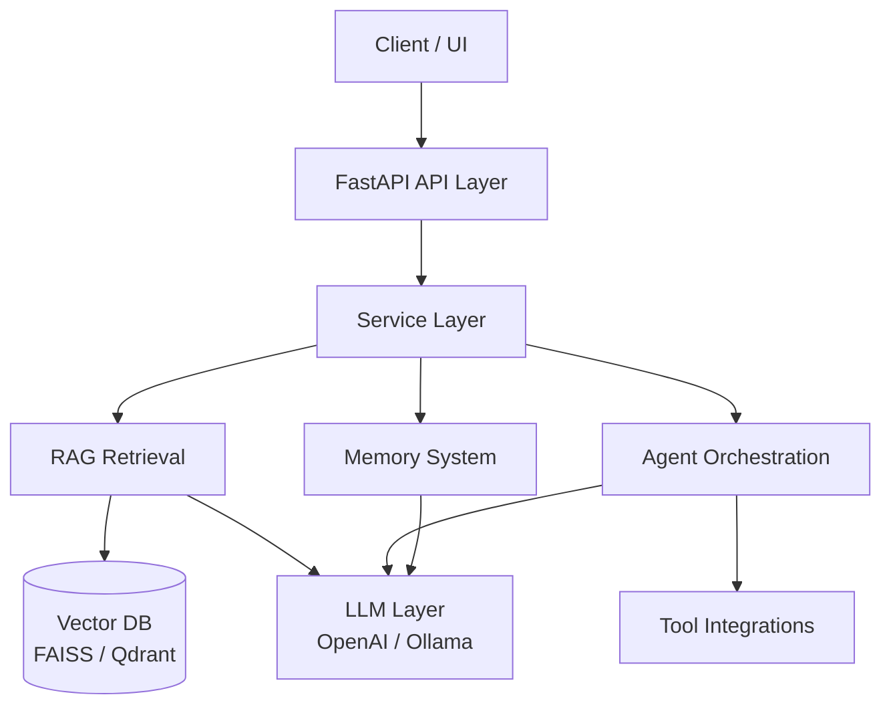

# AI Agent Hub

AI Agent Hub is an experimental platform for building AI agent systems that combine retrieval, memory and tool orchestration.

The goal of the project is to explore architectures for real-world AI systems that go beyond simple chatbots and prompt wrappers.

The system is designed around several core capabilities:

- Retrieval Augmented Generation (RAG)
- Knowledge graphs
- Agent orchestration
- Tool integrations
- Reasoning workflows

This repository represents an engineering exploration of AI orchestration systems.

---

## Why this project exists

Most AI projects today are limited to:

- simple chat interfaces
- prompt wrappers
- basic RAG pipelines

Real AI systems require more complex infrastructure:

- retrieval layers
- memory systems
- tool usage
- multi-step reasoning
- orchestration of multiple components

AI Agent Hub explores how these components can be combined into a coherent AI system architecture.

## Why this project matters

Modern organizations accumulate large volumes of internal knowledge:

- documentation
- research materials
- operational procedures
- technical knowledge

Traditional search systems are often insufficient for navigating this information.

AI systems that combine **retrieval, reasoning and orchestration** can transform how organizations interact with knowledge.

Potential applications include:

- internal knowledge copilots
- research assistants
- AI automation workflows
- document intelligence systems
- enterprise AI agents

AI Agent Hub explores architectural patterns for building such systems in a structured and modular way.

---

## Key capabilities

### Retrieval systems

- Vector search (FAISS / Qdrant)
- Document ingestion pipelines
- Semantic retrieval workflows

### Agent orchestration

- Multi-step reasoning
- Tool usage
- Agent workflows

### Memory

- Semantic memory
- Workspace memory
- Long-term context

### Tool systems

- External API tools
- MCP server integration
- Safe execution model

---

## Example use cases

The architecture can support systems such as:

- Internal knowledge assistants
- AI research agents
- Document intelligence systems
- AI automation pipelines
- Enterprise knowledge copilots

---

## Architecture overview

The project follows a layered architecture.

src/
├── core/          # contracts and shared abstractions
├── layers/        # Base and Pro capability layers
├── api/           # FastAPI interface
├── adapters/      # integrations with external systems
└── services/      # orchestration logic

Architecture principles:

- contract-first development
- dependency inversion
- modular components
- test-driven workflow

## System Architecture

    Client / UI
        |
    FastAPI API Layer
        |
    Service Layer
    /     |      \
 RAG   Memory   Agent Orchestration
  |       |            |
FAISS/   Context      Tool
Qdrant   State        Integrations
   \      |            /
      LLM Layer (OpenAI / Ollama)

Detailed architecture documentation:

docs/architecture/ARCHITECTURE_V3.md

---

## Project status

Current stage:

Phase 0 — Base stabilization

Focus:

- stabilizing core architecture
- enforcing clean boundaries between layers
- preparing the foundation for Pro capabilities

Roadmap:

docs/roadmaps/pro-v3.1.md

---

## Quick start

Install base environment:

python -m pip install -e ".[base,test]"

Install full base environment:

python -m pip install -e ".[base,security,embeddings,faiss,ingest,test]"

Run API:

uvicorn src.api.main:app --reload

Run demo:

python scripts/demo_golden_path.py

Pro reasoning demo:

DEMO_ENABLE_REASONING=1 python scripts/demo_golden_path.py

---

## Documentation

Architecture  
docs/architecture/ARCHITECTURE_V3.md

API  
docs/api/README.md

Installation guides  
docs/installation/

Development snapshots  
docs/snapshots/

---

## Tech stack

Core technologies used in this project:

- Python
- FastAPI
- FAISS
- Qdrant
- Ollama
- Docker
- Prometheus / Grafana

---

## Project goals

This repository explores:

- AI orchestration architectures
- retrieval systems
- reasoning pipelines
- agent workflows

The project serves both as:

- an engineering research project
- a foundation for production AI systems

---

## Author

Aleksandr Ladygin  
AI / LLM Engineer & Systems Architect

Building applied AI systems focused on:

- RAG
- AI agents
- knowledge systems
- AI automation workflows

## System Architecture

