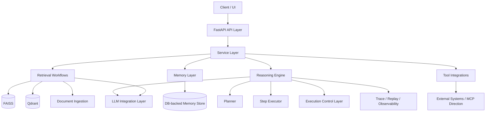

# AI Agent Hub


Layered AI platform for retrieval, memory, graph-aware reasoning, and tool-orchestrated AI systems.


AI Agent Hub is a layered AI platform for building retrieval, memory, graph-aware reasoning, and tool-orchestrated agent systems.

The platform is designed around a **stable Base layer** and **feature-gated Pro extensions**, so advanced capabilities can evolve without breaking the core system.

It focuses on building production-oriented AI workflows that combine:

- retrieval pipelines
- document ingestion
- workspace and semantic memory
- graph-aware reasoning
- tool integrations
- execution control
- observability and traceability

## Core capabilities

AI Agent Hub explores architectures for modern AI systems that combine:

- **Retrieval pipelines** (vector search, hybrid retrieval)
- **Memory systems** (workspace and semantic memory)
- **Graph-aware reasoning**
- **Tool orchestration**
- **Execution control and observability**

The project focuses on building modular AI infrastructure rather than single-purpose AI applications.

## Why this project exists

Many AI projects stop at one of these levels:

- simple chat interfaces
- prompt wrappers
- basic RAG demos
- narrow automation scripts

Real AI systems require more than a single model call.

They need structured retrieval, memory, reasoning, tool access, execution boundaries, diagnostics, and architecture that remains maintainable as the system grows.

AI Agent Hub exists to explore and implement those capabilities as a coherent platform rather than as a collection of disconnected experiments.

## What this project is

AI Agent Hub is an engineering-focused platform for developing modular AI systems that go beyond baseline chatbots and simple retrieval pipelines.

The repository is organized to support incremental growth from a reliable core into more advanced capabilities:

- **Base layer** for stable platform capabilities
- **Pro layer** for advanced feature-gated capabilities
- clean boundaries between contracts, services, adapters, and delivery
- architecture intended for long-term evolution rather than short-lived demos

This structure allows the project to evolve incrementally without collapsing into tightly coupled code.

## Current implementation status

The codebase already includes a substantial set of implemented components.

### Base layer

- FastAPI API layer
- document upload and ingestion pipeline
- vector search workflows
- export pipeline
- storage abstractions
- provider facade and integration boundaries
- health and deep-health endpoints
- streaming support

### Pro layer

- hybrid retrieval
- Qdrant vector store integration
- DB-backed memory store
- GraphRAG-oriented components
- reasoning engine
- multi-step reasoning planner
- step execution flow
- reasoning quality loop
- confidence and evidence processing
- trace collection and replay
- reasoning observability timeline
- reasoning control layer

### Platform and operations

- feature flags for advanced capabilities
- clean separation of Base and Pro concerns
- Alembic migrations
- Prometheus / Grafana monitoring setup
- CI pipelines
- unit and integration test coverage

## Key capabilities

### Retrieval

- vector search
- hybrid retrieval
- FAISS support
- Qdrant support
- document ingestion pipelines
- retrieval policy evolution path

### Memory

- workspace-aware memory
- DB-backed memory store
- semantic memory wiring
- memory integrated into retrieval and reasoning workflows

### Graph and reasoning

- GraphRAG-oriented building blocks
- graph-aware reasoning flow
- multi-step reasoning planner
- reasoning execution chain
- evidence normalization
- confidence scoring
- reasoning trace and replay
- reasoning observability timeline
- runtime execution control layer

### Tool orchestration

- service-layer orchestration
- tool integration boundaries
- MCP-oriented integration direction
- safe extensibility through adapters

### Platform engineering

- FastAPI-based API surface
- modular architecture
- feature-gated advanced capabilities
- monitoring and diagnostics
- migration support
- CI-backed development workflow

## Architecture overview

Repository structure:

```text
src/
├── core/          # contracts, shared abstractions, configuration
├── layers/        # Base and Pro capability layers
│   ├── base/
│   └── pro/
├── api/           # FastAPI delivery layer
├── adapters/      # external integrations
└── services/      # orchestration and application services
```

Architecture principles:

- contract-first development
- dependency inversion
- modular replaceable components
- stable core with gated advanced extensions
- incremental evolution through explicit anchors
- test-backed engineering workflow

System architecture:



## Project status

Current phase: Pro Layer Development - Reasoning Stabilization

Recent focus areas include:

- reasoning observability
- reasoning trace collection
- replay support
- reasoning execution control
- loop guard and retry boundaries

Development follows a structured engineering workflow:

- anchor-based milestones
- snapshot discipline
- CI validation
- incremental micro-patch evolution

## API surface

Main endpoints currently include:

- `/health`
- `/api/v1/health`
- `/api/v1/health/deep`
- `/api/v1/search`
- `/api/v1/search-hybrid`
- `/api/v1/answer`
- `/api/v1/documents/upload`
- `/api/v1/documents`
- `/api/v1/export`
- `/api/v1/stream/{session_id}`

Some advanced flows are feature-gated depending on Pro layer enablement.

## Example use cases

The architecture supports systems such as:

- internal knowledge assistants
- AI research copilots
- enterprise knowledge copilots
- document intelligence systems
- graph-aware reasoning systems
- AI automation pipelines
- tool-using domain assistants

## Quick start

Install base environment:

```bash
python -m pip install -e ".[base,test]"
```

Install extended environment:

```bash
python -m pip install -e ".[base,security,embeddings,faiss,ingest,test]"
```

Run API:

```bash
uvicorn src.api.main:app --reload
```

Run demo:

```bash
python scripts/demo_golden_path.py
```

Run reasoning demo:

```bash
DEMO_ENABLE_REASONING=1 python scripts/demo_golden_path.py
```

## Documentation

Main project documentation:

- `docs/architecture/ARCHITECTURE_V3.md`
- `docs/architecture/REQUIRED_CHECKS_MATRIX.md`
- `docs/architecture/ASSISTANT_RUNTIME.md`
- `docs/architecture/INTENT_PLAN_ORCHESTRATOR.md`
- `docs/architecture/CONFIRMATION_HANDSHAKE_RUNTIME.md`
- `docs/architecture/APPROVAL_EXECUTION_GATEWAY_RUNTIME.md`
- `docs/architecture/DURABLE_APPROVAL_RECOVERY_RUNTIME.md`
- `docs/architecture/CONTROLLED_EXECUTION_PILOT_RUNTIME.md`
- `docs/architecture/LLM_PLANNER_RUNTIME.md`
- `docs/architecture/DYNAMIC_TOOL_SELECTION_RUNTIME.md`
- `docs/architecture/FEEDBACK_LEARNING_RUNTIME.md`
- `docs/architecture/FEEDBACK_ADAPTATION_RUNTIME.md`
- `docs/architecture/ASSISTANT_CONVERSATIONAL_RECOVERY_RUNTIME.md`
- `docs/architecture/ARCHITECTURE_HARDENING_RUNTIME.md`
- `docs/development/TECHNICAL_DEBT_REGISTRY.md`
- `docs/development/DOCS_TOPOLOGY_POLICY.md`
- `docs/api/README.md`
- `docs/api/A2.33_PATCH1_API_RUNTIME_AUDIT.md`
- `docs/installation/`
- `docs/roadmaps/pro-v3.1.md`
- `docs/snapshots/`
- `docs/development/STATUS.md`
- `docs/development/PROJECT_ANCHOR.md`
- `docs/development/PROJECT_CHECKLIST.md`
- `docs/architecture/PLATFORM_FEATURES.md`

## Tech stack

Core technologies used in the project:

- Python
- FastAPI
- Pydantic
- FAISS
- Qdrant
- SQLite / SQLAlchemy
- Ollama / OpenAI-compatible integrations
- Prometheus
- Grafana
- Docker
- GitHub Actions

## Engineering direction

AI Agent Hub is evolving toward a modular AI engineering platform focused on:

- retrieval systems
- memory architectures
- graph-aware reasoning
- tool orchestration
- execution control
- observability
- maintainable AI system design

## Author

Aleksandr Ladygin  
AI / LLM Engineer & Systems Architect

Focus areas:

- RAG and hybrid retrieval
- reasoning systems
- AI agents
- memory architectures
- GraphRAG
- tool-integrated LLM systems
